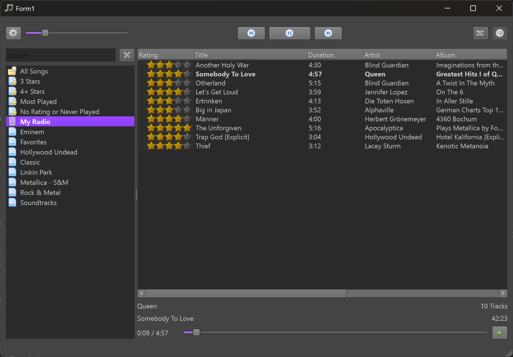
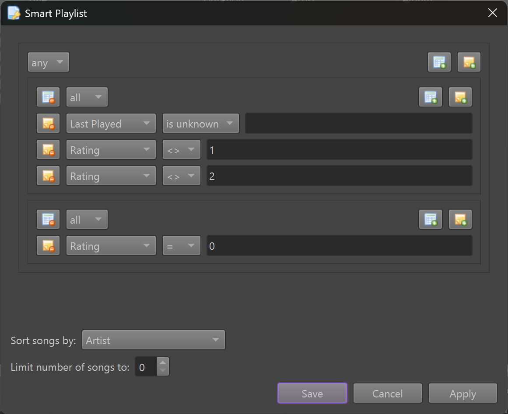
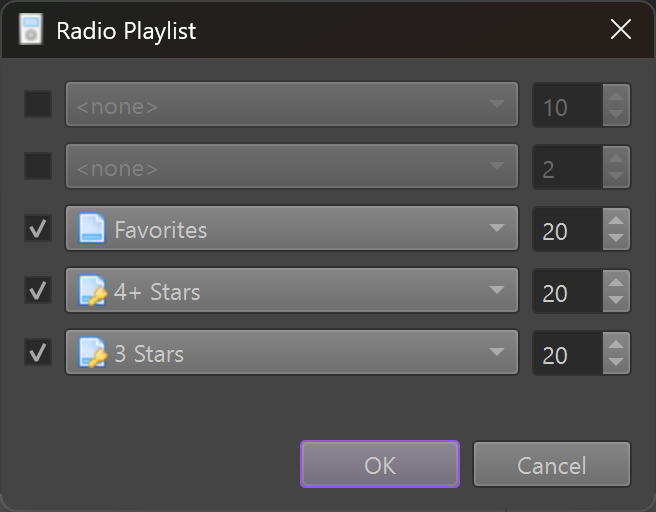
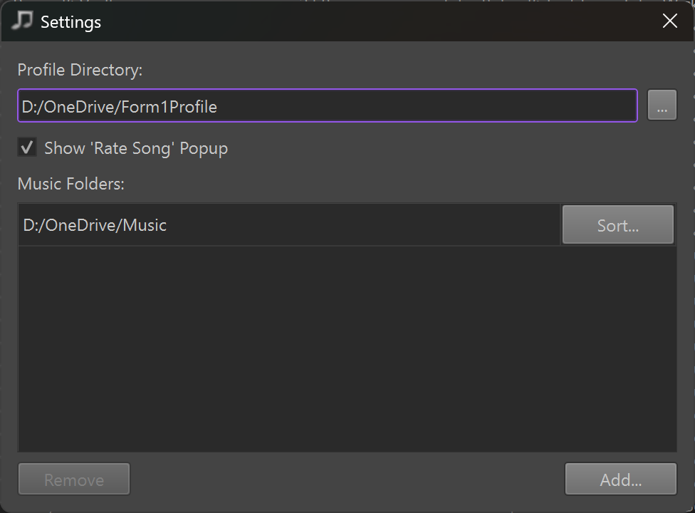

# Form1

A simple music player inspired by iTunes.

## Features

* It only plays your own files from disc (mp3, mp4, ogg, wav, flac, ...).
* No support for streaming online music.
* It can synchronize your music library and playlists across devices simply by putting files into Dropbox, OneDrive or any other shared folder. No setup required.

### Smart Playlists

These playlists allow you to set up rules which songs they should contain.

### Radio Playlists

Radio playlists play a random song from other playlists.

### Shared Music Folders and Profiles

You can give Form1 multiple folders to inspect for music. You also give it one folder where to put your personal profile. If these folders are in a shared folder (such as OneDrive or Dropbox), information is automatically shared between PCs. Thus you can listen to music on one device, add or edit playlists, rate songs, etc, and when you then open Form1 on another PC, the same changes will be visible there, too.

